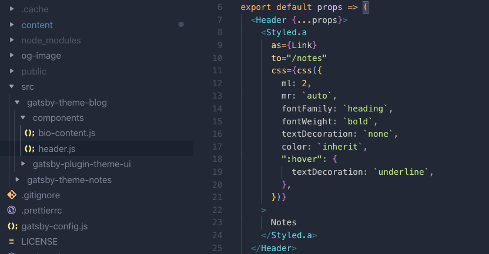

In July 2019, Gatsby announced the <a href='https://www.gatsbyjs.org/blog/2019-07-03-announcing-stable-release-gatsby-themes/#reach-skip-nav'> stable release </a> of Gatsby themes -- an effort led by Gatsby contractor <a href="https://twitter.com/@chrisbiscardi">Chris Biscardi.</a> Why should you care? Read on...

---

### 1) Automated dependency updates

_'Using a Gatsby theme, all of your default configuration (shared functionality, data sourcing, design) is abstracted out of your site, and into an installable package.'_ <br />
_Chris Biscardi_

Until now, we've had to rely on <a href='https://www.gatsbyjs.org/docs/starters/'> starters</a> for scaffolding Gatsby projects.

Whether you are new to Gatsby or just want to save all the leg work of creating the architecture, starters give you a great leg up.

However, your app can quickly get out of date with stale dependencies and features, and the only real way to update is manually.

Gatsby themes are resolved through your package manager. Updating core dependencies is a matter of bumping a version in your package.json.

```js
module.exports = {
  plugins: ["gatsby-theme-blog", "gatsby-theme-notes"],
}
```

---

### 2) MDX

_'MDX is an authorable format that lets you seamlessly use JSX in your markdown documents.'_ [mdx github](https://github.com/mdx-js/mdx)

[MDX]('https://mdxjs.com/') -- Simply put -- is JSX in markdown.

When I set out to build a design system at my day job, MDX changed my life.

For several months I banged my head against my desk trying to wire up rehypeReact with dangerouslySetInnerHTML to render a code snippet and component demo in my markdown.

```jsx
import AwesomeComponent from "./AwesomeComponent"

## Check out my awesome component!

    <AwesomeComponent>{children}</AwesomeComponent>
```

Whilest perusing Google search results for large buildings to leap from, I stumbled across the miracle of Biscardi's gatsby-mdx plugin. But I digress...

With [Gatsby-theme-blog-core](https://github.com/gatsbyjs/gatsby/tree/master/themes/gatsby-theme-blog-core), you don't even need to configure(or maintain) a plugin to use MDX in your Gatsby project. Just As a past user of both 'gatsby-mdx' (now deprecated) and 'gatsby-plugin-mdx', this is extremely refreshing.

Just flick that boolean to true and you're off to the races.

```js
// gatsby-config.js
module.exports = {
  plugins: [
    {
      resolve: `gatsby-theme-blog-core`,
      options: {
        // ...options
        mdx: true,
      },
    },
  ],
}
```

---

### 3) Component Shadowing

This is where themes get _really_ cool.

Component shadowing 'allows users to replace a file in the src directory that is included in the webpack bundle with their own implementation.'



Don't quite like the out of the box theme Header? Wish you could add/remove/replace a feature? No longer do you have to adopt a 'take it or leave it' approach to a component, just create a file with the same name in the same directory tree and modify it to your heart's content.

### Related

- Getting started with Gatsby Themes (Coming Soon)
- Component Shadowing in Gatsby Themes (Coming Soon)
- Building a custom Gatsby Theme (Coming Soon)

#### Links

https://www.gatsbyjs.org/docs/themes/what-are-gatsby-themes/

https://github.com/mdx-js/mdx

https://github.com/gatsbyjs/gatsby-starter-theme
